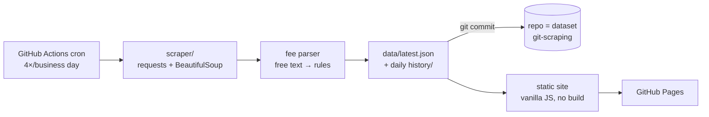

# 💱 taiwan-fx-rates — 台灣換匯比價

**Which Taiwanese bank should you exchange currency at before a trip?** This site answers that with one number: the **all-in TWD cost** — quoted rate × amount **+ the cash-handling fee** — ranked across ~35 banks, auto-updated 4× every business day.

**Live site:** https://mullerchen910912.github.io/taiwan-fx-rates/

[中文摘要在最下方 ↓](#中文摘要)

## Why rate boards alone mislead

Two real cases from the data (JPY 100,000, 2026-07-19):

1. **Same rate, NT$500 apart.** Mega Bank and Standard Chartered both quoted cash-sell 0.2025. Mega charges no fee; Standard Chartered charges NT$500 per transaction. Sorting by rate calls them a tie — sorting by total cost puts them first and last.
2. **The best rate was three weeks old.** The aggregator showed Bank of Taiwan with the lowest JPY cash-sell rate, displaying update time "17:00". The *date* however lives in a hidden HTML comment (`<!--2026-06-29-->17:00`) — the quote had been frozen for ~3 weeks (Bank of Taiwan's rate page added a proof-of-work anti-bot wall, which apparently broke the aggregator's scraper). Ranking on that number would be planning around a price that no longer exists.

So this project's two design commitments: **rank by total cost, not rate**, and **surface data staleness instead of hiding it** (rows not updated for >3 days are flagged and excluded from the default ranking).

## How it works



- **Scraper** (`scraper/`): fetches per-currency pages from [findrate.tw](https://www.findrate.tw/) (which aggregates the banks' official rate boards), parses the table **including the hidden date comments**, and normalizes `--` (no cash service) to `null`. One broken currency never kills the rest.
- **Fee parser** (`scraper/fees.py`): the fee column is human-written Chinese free text. The observed corpus reduces to three computable shapes — flat (`每筆NT$100`), percent-with-floor (`總額0.7%,最低NT$100`), free (`免手續費`) — plus direction-specific variants (`本行賣免收,買入每筆100`). Coverage is ~95% of bank rows; anything ambiguous keeps `kind: "unknown"` and the UI shows the verbatim note with a "?" instead of silently assuming a number.
- **Data** (`data/`): `latest.json` is what the site reads; a daily snapshot lands in `history/` and every change is committed, so the repo doubles as a time-series dataset ([git-scraping](https://simonwillison.net/2020/Oct/9/git-scraping/) pattern).
- **Site** (`site/`): dependency-free vanilla JS/CSS. Pick currency, direction (buying for a trip / selling leftovers back), channel (cash vs. spot), and amount — percent fees are computed against *your* amount, so the ranking can flip between a NT$50k and a NT$500k exchange. Mobile-first, dark-mode aware.
- **Promotions overlay** (`data/promos.json`): a manually-curated, dated list of channels that beat the board rate — Bank of Taiwan online exchange (免手續費 + rate rebate, airport pickup), E.SUN online-banking spot rebates, Mega foreign-currency ATM discounts. Because these depend on channel, account, and time-of-day and change often, they are shown as a clearly-labelled reference layer with links to each bank's official page and are **not** folded into the ranking number (that would fake a precision the promos don't have).
- **CI** (`.github/workflows/update.yml`): fixture-based parser tests run before every scrape as a layout-change tripwire; then scrape → commit data → deploy Pages.

## Run locally

```bash
python3 -m venv .venv && .venv/bin/pip install -r requirements.txt
.venv/bin/python -m pytest tests/ -q        # 21 tests against a saved HTML fixture
.venv/bin/python -m scraper.main            # fetch live rates → data/latest.json
scripts/build_site.sh                       # assemble _site/
python3 -m http.server 8642 --directory _site
```

## Honest caveats

- Quoted board rates only. **Online-exchange promos and foreign-currency ATMs often beat the board** (banks shave the spread for self-service channels); those discounts aren't machine-readable and are not included.
- Fee notes sometimes distinguish customers vs. non-customers; the headline number follows the first quoted price and the raw note is always shown. Staleness uses a calendar-day heuristic (>3 days) and ignores Taiwan public holidays.
- Data © the respective banks, aggregated via findrate.tw. This is a comparison aid, not financial advice.

## Data validation

Scraped numbers were cross-checked against banks' own official rate pages on the same day (2026-07-20): E.SUN's published JPY and USD cash/spot rates matched our scraped values on all eight data points. The check also caught Bank of Taiwan's board being frozen for ~3 weeks on the aggregator — exactly the staleness the site is built to flag.

## Roadmap

- [x] Manually-curated overlay of online-exchange / FX-ATM promos
- [ ] Trend charts from `data/history/` ("is today a good day to exchange?")
- [ ] Rate-threshold notifications

## 中文摘要

出國前想知道**去哪家銀行換外幣最划算**?牌告匯率相同的兩家銀行,手續費可以差到 NT$500;匯率聚合網站上「最便宜」的那家,牌價可能已經三週沒更新(日期藏在 HTML 註解裡)。本站直接排名**含手續費的總台幣成本**、自動標記過舊牌價,每個銀行營業日更新 4 次。資料來源為比率網(各銀行牌告);線上結匯與外幣 ATM 常有額外減碼,實際成交以各銀行為準。

## License

MIT
